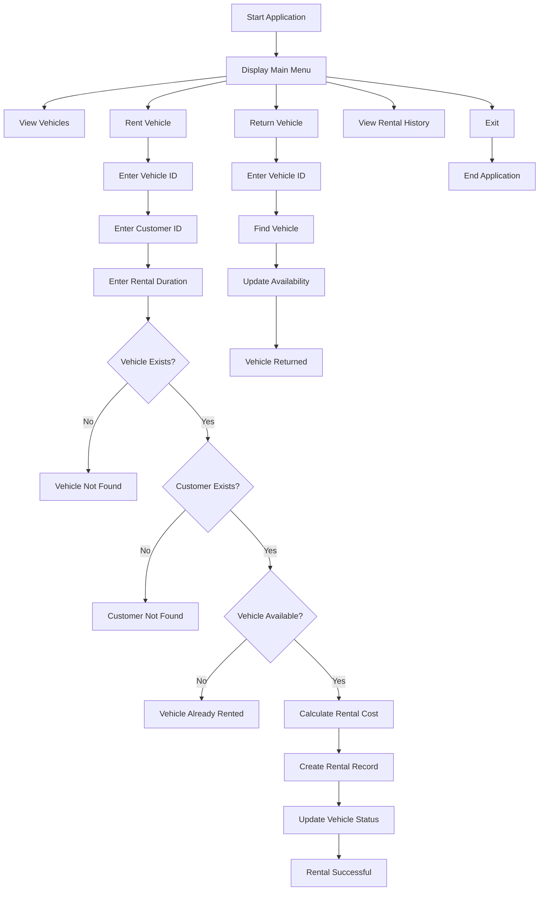
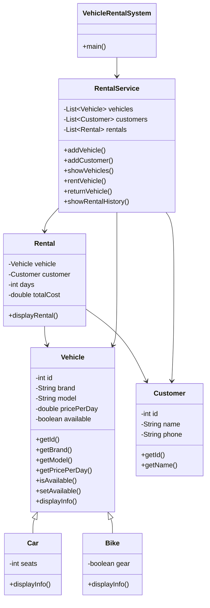

# 🚗 VEHICLE RENTAL MANAGEMENT SYSTEM – Java OOP Project

## 📌 Overview

The **Vehicle Rental Management System** is a console-based Java application developed using **Core Java and Object-Oriented Programming (OOP)** principles.

The system is designed to manage vehicles, customers, rental operations, vehicle returns, rental history, vehicle availability, and rental cost calculation through an interactive command-line interface.

The project represents a real-world vehicle rental workflow where customers can select available vehicles, rent them for a specific duration, calculate rental costs, and return the vehicles after use.

The application demonstrates practical implementation of **Classes and Objects, Encapsulation, Inheritance, Polymorphism, Method Overriding, Constructors, Object Composition, Collections, and Business Logic**.

---

# ⭐ Highlights

- Java-based Vehicle Rental Management System.
- Console-based interactive application.
- Vehicle management and availability tracking.
- Customer management.
- Vehicle rental functionality.
- Vehicle return functionality.
- Automatic rental cost calculation.
- Rental history management.
- Support for different vehicle types.
- Inheritance-based vehicle hierarchy.
- Polymorphism through method overriding.
- Encapsulation of vehicle and customer information.
- Object composition between rental, vehicle, and customer objects.
- ArrayList-based in-memory data management.
- Vehicle and customer ID validation.
- Prevention of renting unavailable vehicles.
- Modular Object-Oriented Programming architecture.

---

# 🎯 Objectives

The main objectives of this project are:

- To develop a practical application using Core Java.
- To implement real-world entities using Object-Oriented Programming.
- To manage different types of vehicles.
- To maintain vehicle availability status.
- To manage customer information.
- To implement vehicle rental operations.
- To implement vehicle return operations.
- To calculate rental costs dynamically.
- To maintain rental transaction history.
- To demonstrate inheritance and polymorphism.
- To practice Java Collections Framework.
- To implement basic validation and business logic.
- To develop a structured and maintainable console application.

---

# 🚀 Features

## 🚘 Vehicle Management

- Add vehicles to the system.
- View registered vehicles.
- Display vehicle details.
- Track vehicle availability.
- Identify available and rented vehicles.
- Support multiple vehicle types.

## 👤 Customer Management

- Register customers.
- Store customer information.
- Search customers using Customer ID.
- Associate customers with rental transactions.

## 📋 Rental Management

- Rent available vehicles.
- Validate Vehicle ID.
- Validate Customer ID.
- Check vehicle availability.
- Enter rental duration.
- Calculate total rental cost.
- Create rental records.
- Update vehicle status after rental.

## 🔄 Vehicle Return

- Return rented vehicles.
- Search vehicle using Vehicle ID.
- Check vehicle status.
- Update vehicle availability.
- Mark returned vehicles as available.

## 📊 Rental History

- Store rental transactions.
- Display customer information.
- Display rented vehicle information.
- Display rental duration.
- Display total rental cost.

---

# 🏗️ System Architecture

The system follows an object-oriented architecture:

```text
                 VEHICLE RENTAL MANAGEMENT SYSTEM
                              │
                              ▼
                    Console User Interface
                              │
                              ▼
                   Rental Management Service
                              │
            ┌─────────────────┼─────────────────┐
            ▼                 ▼                 ▼
        Vehicles          Customers          Rentals
            │                 │                 │
            ▼                 ▼                 ▼
          Car               Customer        Rental Record
          Bike
```

---

# 🔄 System Workflow



---

# 📂 Project Structure

```text
Vehicle-Rental-Management-System/
│
├── src/
│   ├── Vehicle.java
│   ├── Car.java
│   ├── Bike.java
│   ├── Customer.java
│   ├── Rental.java
│   ├── RentalService.java
│   └── VehicleRentalSystem.java
│
├── screenshots/
│   ├── menu.png
│   ├── vehicles.png
│   ├── rental.png
│   ├── return.png
│   └── history.png
│
├── README.md
└── .gitignore
```

---

# 🧱 Class Architecture

The application is divided into multiple classes to improve modularity and maintainability.



---

# 🛠️ Technologies Used

- **Java**
- **Core Java**
- **Object-Oriented Programming**
- **Java Collections Framework**
- **ArrayList**
- **Scanner**
- **Constructors**
- **Inheritance**
- **Polymorphism**
- **Method Overriding**
- **Encapsulation**
- **Object Composition**

---

# 🧠 Object-Oriented Programming Concepts

## 1. Encapsulation

The project uses private variables to protect the internal state of objects.

```java
private int id;
private String brand;
private String model;
private double pricePerDay;
private boolean available;
```

Getter and setter methods are used to provide controlled access to object data.

---

## 2. Inheritance

Different vehicle types inherit common properties and behavior from the `Vehicle` class.

```java
class Car extends Vehicle
```

```java
class Bike extends Vehicle
```

Inheritance structure:

```text
                Vehicle
                /     \
              Car     Bike
```

---

## 3. Polymorphism

Polymorphism is implemented through method overriding.

Example:

```java
@Override
public void displayInfo() {
    // Vehicle-specific implementation
}
```

Different vehicle classes can provide their own implementation of the same method.

---

## 4. Classes and Objects

The project uses separate classes to represent real-world entities:

- Vehicle
- Car
- Bike
- Customer
- Rental
- RentalService
- VehicleRentalSystem

Objects created from these classes represent actual vehicles, customers, and rental transactions.

---

## 5. Object Composition

The `Rental` class maintains references to both `Vehicle` and `Customer`.

```text
Rental
  │
  ├── Vehicle
  │
  └── Customer
```

This represents the relationship between a customer and the vehicle being rented.

---

## 6. Constructors

Constructors are used to initialize objects when they are created.

Example:

```java
public Vehicle(
        int id,
        String brand,
        String model,
        double pricePerDay) {

    this.id = id;
    this.brand = brand;
    this.model = model;
    this.pricePerDay = pricePerDay;
    this.available = true;
}
```

---

# 🚘 Vehicle Types

The system supports different types of vehicles.

| Vehicle Type | Example |
| ------------ | ------- |
| Car | Toyota Fortuner |
| Car | Honda City |
| Bike | Royal Enfield Classic 350 |
| Vehicle | General Vehicle |

---

# 📋 Sample Vehicle Data

| ID | Brand | Model | Price / Day | Status |
| -- | ----- | ----- | ----------- | ------ |
| 101 | Toyota | Fortuner | ₹3000 | Available |
| 102 | Honda | City | ₹2000 | Available |
| 103 | Royal Enfield | Classic 350 | ₹1000 | Available |

---

# 👤 Customer Management

Customers are represented using the `Customer` class.

Customer information can include:

- Customer ID
- Customer Name
- Phone Number

Example:

```text
Customer ID: 1
Name: Soukarya
Phone: 9876543210
```

Customers can then be associated with rental transactions.

---

# 💰 Rental Cost Calculation

The system calculates the total rental cost based on the daily rental price and rental duration.

### Formula

```text
Total Rental Cost = Price Per Day × Number of Days
```

### Example

```text
Vehicle: Toyota Fortuner
Price Per Day: ₹3000
Rental Duration: 3 Days

Total Cost = ₹3000 × 3

Total Cost = ₹9000
```

---

# 🔄 Rental Process

The rental process follows these steps:

```text
1. Enter Vehicle ID
        ↓
2. Enter Customer ID
        ↓
3. Enter Number of Days
        ↓
4. Validate Vehicle
        ↓
5. Validate Customer
        ↓
6. Check Vehicle Availability
        ↓
7. Calculate Rental Cost
        ↓
8. Create Rental Record
        ↓
9. Update Vehicle Status
        ↓
10. Display Rental Details
```

---

# 🔁 Vehicle Return Process

The vehicle return process follows:

```text
1. Enter Vehicle ID
        ↓
2. Find Vehicle
        ↓
3. Check Current Status
        ↓
4. Update Availability
        ↓
5. Mark Vehicle as Available
```

---

# 📊 Rental History

Rental transactions are maintained using Java Collections.

Each rental record contains information such as:

- Customer details
- Vehicle details
- Rental duration
- Total rental cost

Example:

```text
===== RENTAL DETAILS =====

Customer: Soukarya
Vehicle: Toyota Fortuner
Days: 3
Total Cost: ₹9000.0
```

---

# 📊 Results

The implemented system successfully demonstrates a complete basic vehicle rental workflow using Java and Object-Oriented Programming.

### Overall System Results

| Metric / Component | Status |
| ------------------ | ------ |
| Vehicle Management | Implemented |
| Customer Management | Implemented |
| Vehicle Rental | Implemented |
| Vehicle Return | Implemented |
| Rental Cost Calculation | Implemented |
| Vehicle Availability Tracking | Implemented |
| Rental History | Implemented |
| Multiple Vehicle Types | Implemented |
| OOP Architecture | Implemented |
| In-Memory Data Management | Implemented |
| Console-Based Interface | Implemented |
| Input Validation | Implemented |

---

# 🏆 Key Findings

- The system successfully manages vehicle records.
- Vehicle availability is updated after rental and return operations.
- Customers can be associated with rental transactions.
- Rental costs are calculated based on rental duration.
- The system checks vehicle availability before creating a rental.
- Vehicle and customer IDs are used to identify records.
- Different vehicle types are implemented using inheritance.
- Method overriding provides vehicle-specific behavior.
- ArrayList is used to manage vehicles, customers, and rental records.
- The project demonstrates practical implementation of Core Java OOP concepts.
- The modular structure allows individual components to be extended in future versions.
- The current application provides a foundation for future database integration.

---

# 📈 OOP Concept Implementation

The following OOP concepts are implemented in the project:

| OOP Concept | Implementation |
| ----------- | -------------- |
| Encapsulation | Private fields with getters/setters |
| Inheritance | Car and Bike extend Vehicle |
| Polymorphism | Method overriding |
| Abstraction | Common vehicle behavior |
| Composition | Rental contains Vehicle and Customer objects |
| Constructors | Object initialization |
| Classes & Objects | Real-world entity modeling |

---

# 📊 Rental Management Dashboard

The current console application provides a simple command-line view of the rental system.

### System Components

- Total registered vehicles
- Available vehicles
- Rented vehicles
- Customer records
- Rental transactions
- Rental duration
- Total rental cost
- Rental history
- Vehicle status

Example:

```text
========================================
       VEHICLE RENTAL DASHBOARD
========================================

Total Vehicles       : 3
Available Vehicles   : 2
Rented Vehicles      : 1
Total Customers      : 5
Total Rentals        : 4

========================================
```

---

# 🔍 Rental Transaction Analysis

The system records the major information associated with each rental transaction.

| Transaction Component | Description |
| ---------------------- | ----------- |
| Customer | Customer associated with rental |
| Vehicle | Vehicle selected for rental |
| Duration | Number of rental days |
| Price / Day | Daily rental price |
| Total Cost | Calculated rental amount |
| Availability | Vehicle status |

---

# 📊 Evaluation Criteria

The project can be evaluated based on the following functional areas:

- Vehicle management.
- Customer management.
- Rental functionality.
- Return functionality.
- Rental cost calculation.
- Vehicle availability tracking.
- Rental history management.
- Input validation.
- Object-oriented design.
- Code modularity.

### Core Formula

```text
Rental Cost Accuracy
=
Price Per Day × Rental Duration
```

The system uses this calculation to determine the total rental cost for each rental transaction.

---

# 📸 Application Visualizations

The project can include screenshots demonstrating the main application workflows:

- Main Menu
- Vehicle List
- Available Vehicle Status
- Customer Registration
- Rental Operation
- Rental Cost Calculation
- Vehicle Return
- Rental History
- Invalid Input Handling

---

# 🖥️ Application Menu

```text
========================================
       VEHICLE RENTAL SYSTEM
========================================

1. View Vehicles
2. Add Vehicle
3. Register Customer
4. Rent Vehicle
5. Return Vehicle
6. View Rental History
7. Exit

Enter choice:
```

---

# 🚗 Sample Vehicle Display

```text
========================================
             VEHICLE LIST
========================================

ID: 101
Brand: Toyota
Model: Fortuner
Price/Day: ₹3000
Status: Available

ID: 102
Brand: Honda
Model: City
Price/Day: ₹2000
Status: Available

ID: 103
Brand: Royal Enfield
Model: Classic 350
Price/Day: ₹1000
Status: Available
```

---

# 💳 Sample Rental Output

```text
Enter Vehicle ID: 101
Enter Customer ID: 1
Enter Number of Days: 3

Vehicle rented successfully!

========================================
          RENTAL DETAILS
========================================

Customer       : Soukarya
Vehicle        : Toyota Fortuner
Rental Days    : 3
Price Per Day  : ₹3000
Total Cost     : ₹9000

Vehicle Status : Rented
========================================
```

---

# 🔄 Sample Return Output

```text
Enter Vehicle ID: 101

Vehicle returned successfully!

Vehicle Status: Available
```

---

# 🧪 Validation and Error Handling

The system performs basic validation during rental and return operations.

### Vehicle Validation

```text
Vehicle not found.
```

### Customer Validation

```text
Customer not found.
```

### Availability Validation

```text
Vehicle is already rented.
```

### Return Validation

```text
Vehicle is already available.
```

### Menu Validation

```text
Invalid choice.
```

---

# 📈 Data Management

The current version uses Java Collections for in-memory data management.

```java
ArrayList<Vehicle> vehicles;
ArrayList<Customer> customers;
ArrayList<Rental> rentals;
```

These collections are used to manage:

- Registered vehicles.
- Registered customers.
- Rental transactions.

---

# ⚠️ Challenges Faced

During the development of the project, several programming and design challenges were addressed:

- Designing an object-oriented architecture for a real-world rental system.
- Representing different vehicle types using inheritance.
- Maintaining vehicle availability status.
- Managing relationships between customers, vehicles, and rental records.
- Preventing unavailable vehicles from being rented.
- Validating vehicle and customer IDs.
- Calculating rental costs dynamically.
- Managing multiple objects using ArrayList.
- Maintaining rental transaction records.
- Designing a simple and user-friendly console interface.
- Keeping the code modular and reusable.

---

# 🌍 Applications

The system can be used as a basic foundation for:

- Car Rental Management
- Bike Rental Management
- Vehicle Booking Systems
- Fleet Management
- Transportation Services
- Travel and Tourism Services
- Corporate Vehicle Management
- Short-Term Vehicle Rental
- Rental Business Management
- Vehicle Fleet Tracking
- Local Vehicle Rental Services
- Transportation Management

---

# 💻 Hardware and Software Environment

## Hardware

- Standard computer or laptop.
- Minimum 4 GB RAM recommended.
- Keyboard and display for console interaction.
- Sufficient storage for source code and project files.

## Software

- Java JDK 17 or later.
- Visual Studio Code / IntelliJ IDEA.
- Git.
- GitHub.
- Windows, Linux, or macOS.

---

# 🔮 Future Improvements

The current application is a console-based, in-memory system. It can be extended into a complete database-driven and web-based vehicle rental platform.

## 🗄️ Database Integration

- MySQL database integration.
- JDBC connectivity.
- Persistent vehicle records.
- Persistent customer records.
- Persistent rental records.
- Database transaction management.

## 🔐 Authentication

- Admin login.
- Customer login.
- Role-based access control.
- Secure user management.

## 🚘 Advanced Vehicle Management

- Vehicle search.
- Vehicle filtering.
- Vehicle sorting.
- Vehicle categories.
- Vehicle maintenance tracking.
- Vehicle registration management.
- Vehicle insurance information.

## 📅 Booking System

- Rental start date.
- Expected return date.
- Advance booking.
- Reservation management.
- Booking cancellation.
- Vehicle availability calendar.

## 💳 Payment Management

- Payment processing.
- Payment status tracking.
- Invoice generation.
- Rental receipts.
- Online payment integration.

## 🌐 Backend Development

- Spring Boot REST API.
- RESTful services.
- Database-backed application.
- API-based vehicle management.
- Service-layer architecture.

## 🖥️ Frontend Development

- HTML/CSS/JavaScript interface.
- React-based frontend.
- Responsive web application.
- Admin dashboard.
- Customer dashboard.
- Online vehicle booking interface.

---

# 📚 Learning Outcomes

Through this project, the following concepts were practiced:

- Core Java programming.
- Object-Oriented Programming.
- Classes and Objects.
- Encapsulation.
- Inheritance.
- Polymorphism.
- Method Overriding.
- Constructors.
- Access Modifiers.
- Object Composition.
- Java Collections Framework.
- ArrayList.
- Loops and Conditional Statements.
- Input Handling.
- Data Validation.
- Business Logic Implementation.
- Modular Programming.
- Console Application Development.
- Real-world object modeling.

---

# 🚀 Development Roadmap

```text
Version 1.0
     │
     ▼
Core Java + OOP
     │
     ▼
Vehicle Management
     │
     ▼
Customer Management
     │
     ▼
Rental & Return Operations
     │
     ▼
Rental History
     │
     ▼
Input Validation
     │
     ▼
Exception Handling
     │
     ▼
File-Based Persistence
     │
     ▼
JDBC + MySQL
     │
     ▼
Authentication & Authorization
     │
     ▼
Spring Boot REST API
     │
     ▼
Web-Based Frontend
     │
     ▼
Complete Vehicle Rental Platform
```

---

# 📌 Final Result Summary

The **Vehicle Rental Management System** successfully demonstrates the development of a real-world console application using **Java and Object-Oriented Programming principles**.

The application provides the following workflow:

```text
View Vehicles
      ↓
Manage Customers
      ↓
Check Vehicle Availability
      ↓
Rent Vehicle
      ↓
Calculate Rental Cost
      ↓
Create Rental Record
      ↓
Update Vehicle Status
      ↓
Return Vehicle
      ↓
Update Availability
      ↓
View Rental History
```

The project demonstrates how real-world entities such as **vehicles, customers, and rental transactions** can be modeled using Java classes and objects.

The implementation applies important OOP principles including **Encapsulation, Inheritance, Polymorphism, Method Overriding, Constructors, and Object Composition**.

The current in-memory architecture provides a foundation for future development using **JDBC, MySQL, authentication, Spring Boot REST APIs, and a web-based frontend**.

---

# 📊 Project Summary

| Category | Details |
| -------- | ------- |
| Project Name | Vehicle Rental Management System |
| Programming Language | Java |
| Application Type | Console Application |
| Programming Paradigm | Object-Oriented Programming |
| Framework | Core Java |
| Data Structure | ArrayList |
| Database | Not Integrated |
| Data Storage | In-Memory |
| Vehicle Types | Car, Bike, Vehicle |
| Interface | Command Line |
| Architecture | Object-Oriented |
| Version | 1.0 |
| Status | Completed |

---

# 🏆 Key Technical Highlights

```text
Java
Core Java
Object-Oriented Programming
Classes & Objects
Encapsulation
Inheritance
Polymorphism
Method Overriding
Constructors
Object Composition
Collections Framework
ArrayList
Input Validation
Business Logic
Data Management
Console Application
```


---

# 🤝 Contribution

This project was developed as an educational and portfolio project.

Suggestions, improvements, and contributions are welcome.

---

# 📌 About

🚗 **Vehicle Rental Management System** is a Java-based console application designed to demonstrate practical implementation of Object-Oriented Programming through vehicle management, customer management, rental operations, vehicle returns, rental history, availability tracking, and dynamic rental cost calculation.

The project provides a foundation for developing a complete database-driven and web-based vehicle rental platform in future versions.

---

## ⭐ Project Status

```text
Project Name   : Vehicle Rental Management System
Version        : 1.0
Status         : Completed
Language       : Java
Application    : Console-Based
Architecture   : Object-Oriented
Data Storage   : In-Memory
Database       : Not Integrated
Interface      : Command Line
```
